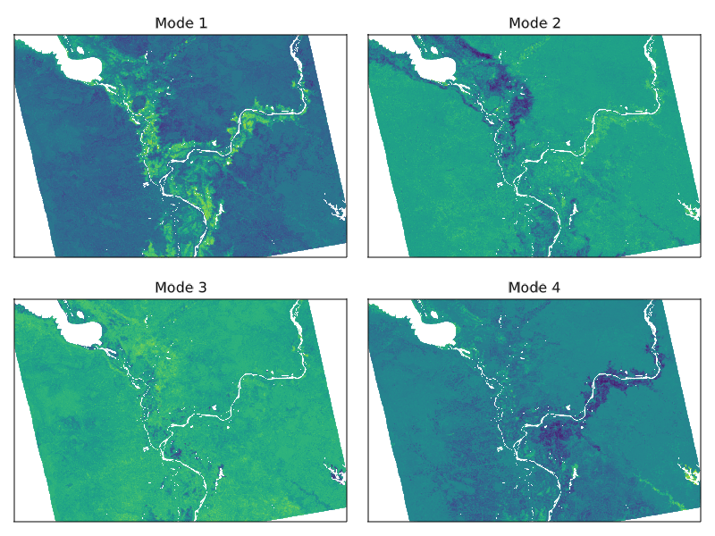
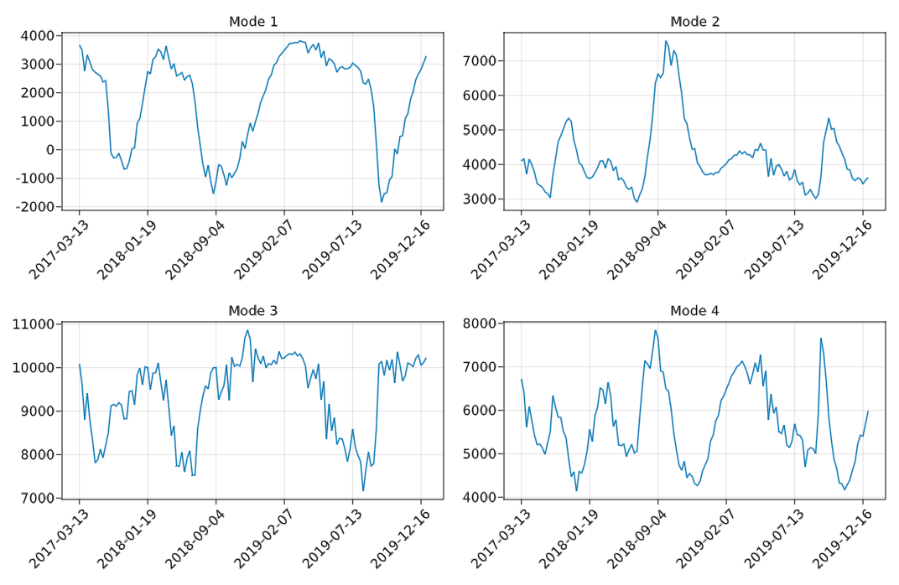

# EmpiricalOrthoFuncs.jl
Julia package for calculating Empirical Orthogonal Functions from spatiotemporal datasets.

This package was heavily inspired by the [`eofs` Python package](https://github.com/ajdawson/eofs) and a good amount of code was translated to Julia from this package.

## Installation

```julia
using Pkg
Pkg.add("EmpiricalOrthoFuncs")
```

##  Example

This example will highlight extracting the spatial and temporal flooding signals from a series of satellite imagery over Southeast Asia

```julia
using EmpiricalOrthoFuncs
using NCDatasets

#load in the data
ds = NCDataset("sar_stack.nc","r");
datain = ds["VV"][:];

# apply EOF
eof = EmpiricalOrthoFunc(datain; timedim=3)

# rotate the EOFs using varimax rotations
nmodes = 4
reof = orthorotation(eof,n=nmodes)

# extract out the signals
# the spatial signals are reshaped back to the original dimensions
temporalsignal = pcs(reof)
spatialsignal = reshape(eofs(reof),(size(datain)[1:2]..., nmodes))
```

When plotting the first four spatial signals we will get the following plot.


Below is the temporal signals corresponding to the spatial signals above


